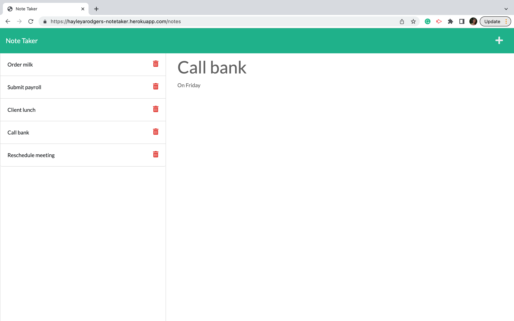

# note-taker

## Table of Contents

* [Description](#description)
* [Access](#access)
* [Credits](#credits)

## Description

My goal for this project was to create an application that can be used to write, save and delete notes. This allows the user to keep track of tasks they need to complete.

To achieve this, I used Javascript—in particular, Express.js. The application’s front end was provided to me in the [starter code](https://github.com/coding-boot-camp/miniature-eureka). I then built the back end, connected the two and deployed the application to Heroku.

During this project, I consolidated my understanding of a website's back end. In particular, I re-inforced what I have learnt about:
- Server set-up
- APIs
- Express.js and persistent storage
- The fs module
- HTML Routes
- Node.js
- Insomnia
- And, Heroku.

## Access

To access the repository where the code is saved, click [here](https://github.com/hayleyarodgers/note-taker).

To access the live application, click [here](https://hayleyarodgers-notetaker.herokuapp.com/).

## Credits

- I used this [starter code](https://github.com/coding-boot-camp/miniature-eureka) to create the front end of the application.